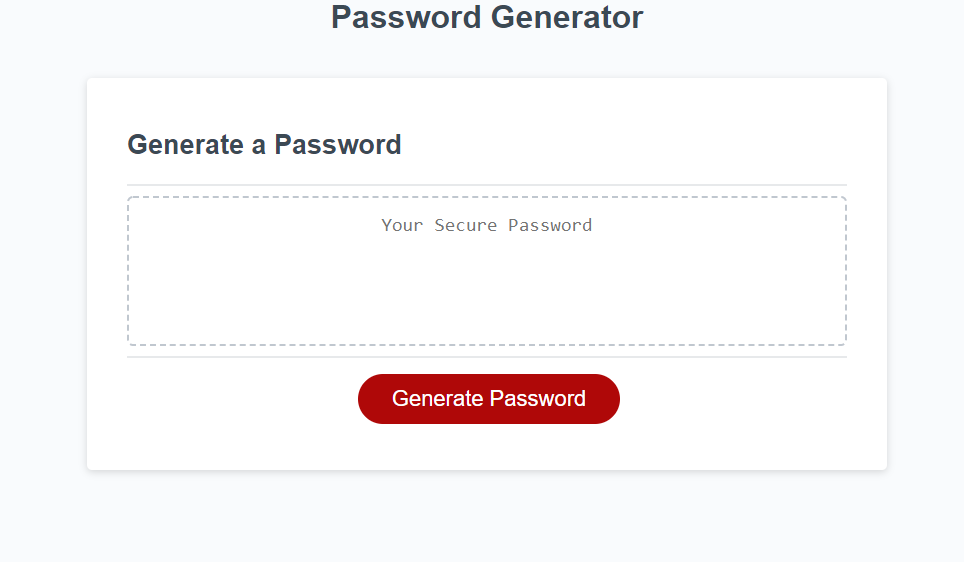
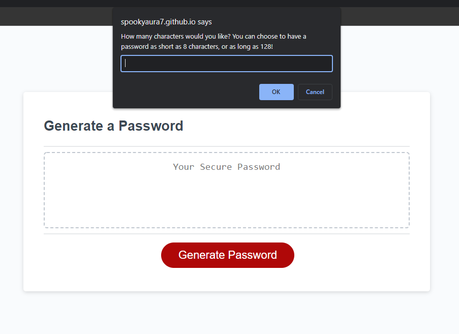
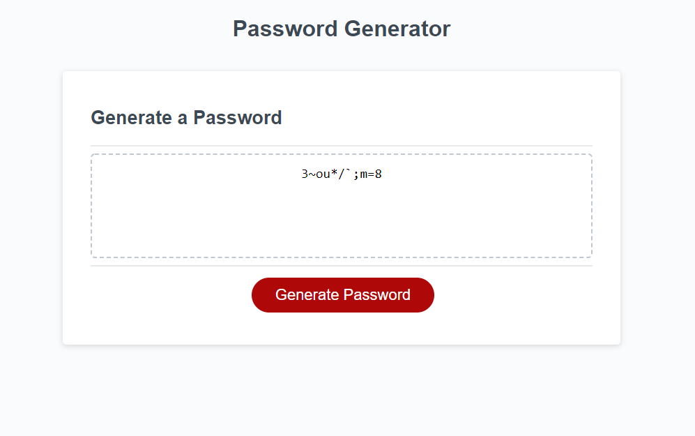

# Password Generator

Installation:

For installation, all you have to do is visit the following link:
https://spookyaura7.github.io/Challenge3-AndrewEvans/

Usage:

All you have to do to use my random password generator is follow the provided link, click the big red button that says "Generate Password":

Follow the prompts to decide just how secure you want your password!

 
Then feel free to copy and paste your super-secure password into the password field of your choice!

Credits:

Most of what I learned to write the code was from the bootcampspot textbook, although I would like to credit w3schools and mdn web docs for their amazing articles. 

The code snippit I used for the randomization was from the user "Foolish Developer" on the website "dev.to" the link to the page is as follows:

https://dev.to/code_mystery/random-password-generator-using-javascript-6a

I did not copy and paste the code directly, but I used and appended what I needed to in order for it to work with my password generator. I also mentioned the credit as a comment in the javascript file above the aforementioned snippet. 

Features:

You can decide to have a password as short as 8 characters long or as long as 128, or anywhere in between.

You can choose whether or not to incorperate uppercase characters, or just use lowercase. 

You can choose whether or not to incorperate numbers.

You can choose whether or not to incorperate special characters.

You get a confirmation alert to make sure you know what you just chose.

License:

As this is a school project, there is no license needed.

Contributors:

There were no other contributors to this project.